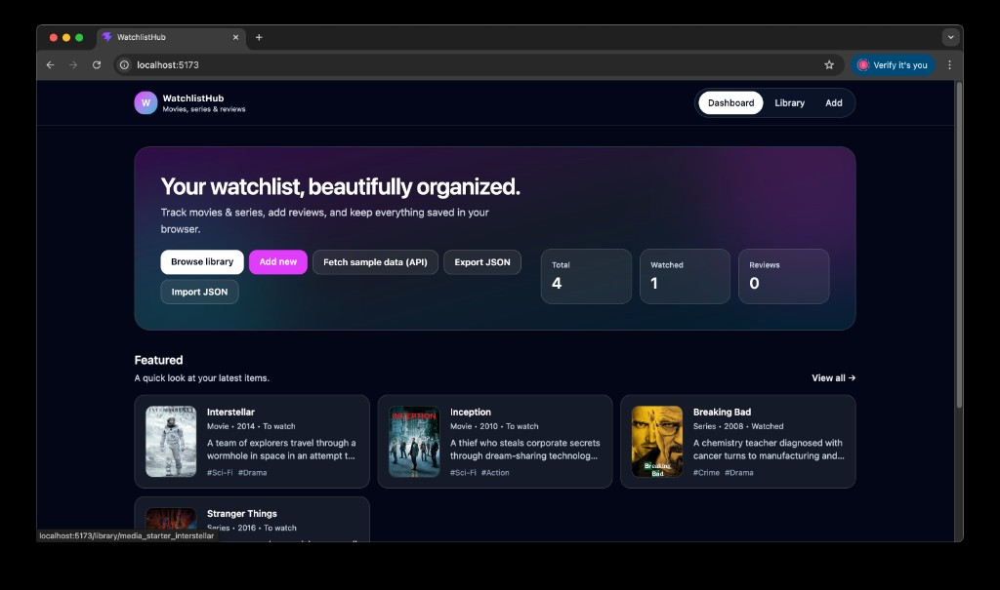
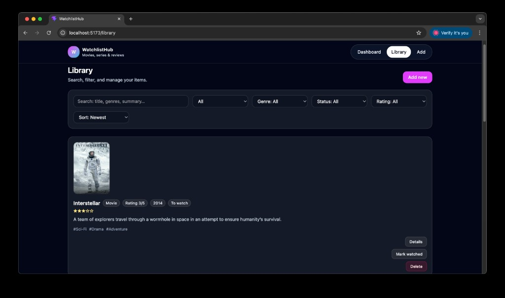
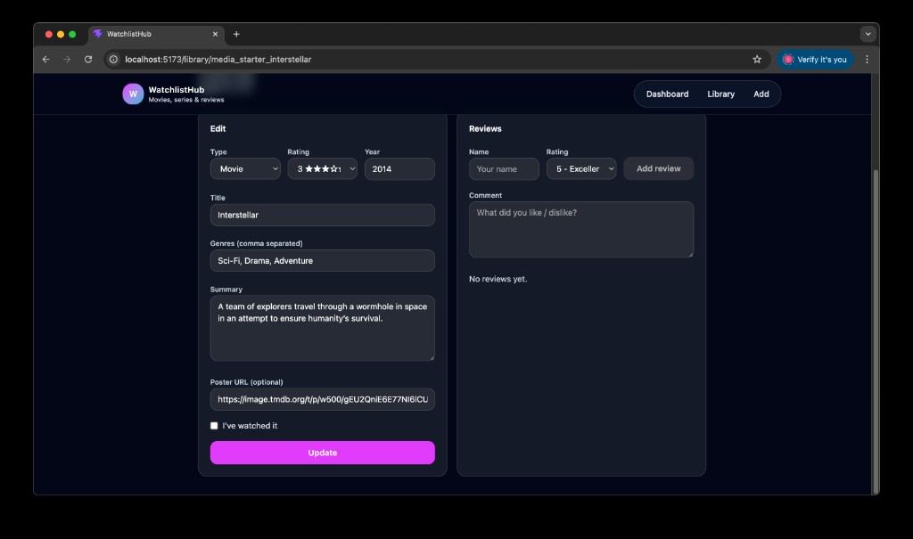
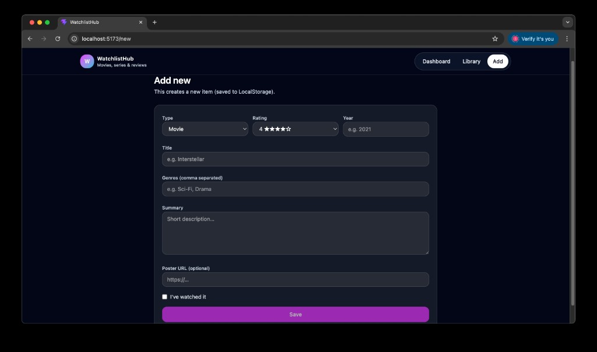

# WatchlistHub (React + TypeScript + Axios + Vite)

Film/Dizi izleme listesi ve yorumlama uygulaması.

## Özellikler

- **Listeleme**: Kütüphane ekranında filtreleme + arama
- **Ekleme**: Yeni film/dizi ekleme formu
- **Güncelleme**: Detay sayfasında düzenleme
- **Silme**: Kütüphane kartından veya detay sayfasından silme
- **Yorum**: Detay sayfasında puan + yorum ekleme
- **LocalStorage**: CRUD verileri tarayıcıda kalıcı
- **JSONPlaceholder + Axios**: Dashboard’da “Örnek veri getir (API)” ile başlangıç verisi çekme

## Çalıştırma

```bash
npm install
npm run dev
```

## Build

```bash
npm run build
npm run preview
```

## Netlify Deploy

- **Build command**: `npm run build`
- **Publish directory**: `dist`

> SPA routing için Netlify’da `public/_redirects` dosyası ekleyebilirsin:
>
> `/* /index.html 200`

## Ekran Goruntuleri





